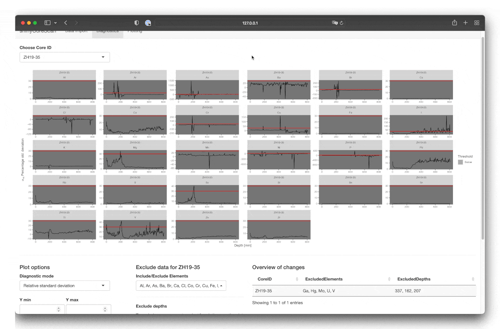

# Welcome to carrrotter 

<!-- badges: start -->
[](https://github.com/blaidd4drwg/carrrotter/actions)
<!-- badges: end -->


## Overview

carrrotter is a tool package for sedimentologists, limnogeologists, and scientists in general who work with sediment cores/core logs. Currently, the package is focused on processing bAXIL Batch CSV export files produced by Avaatech XRF scanners. Old WinAXIL CSV/excel files are currently not supported but may be added.

* This package aims to facilitate parsing the export files the Avaatech bAXIL software produces (one per tube voltage usually) and to convert them into one tidy data frame. Batch parsing was tested successfully with hundreds of CSV files in one go.
*  Additionally, this package includes an R Shiny web app that allows for interactive analyses of the export data. It also allows checking the goodness of fit and the relative error of the fitting process and removing outliers if necessary. The resulting data (with an overview of removed data) can then be exported. The Shiny app can be called using the function `shinycorescan()`.

## Installation

The carrrotter package is currently available for installation from GitHub. The `remotes` package needs to be installed first to install it. To install both and load carrrotter, run:

```r
install.packages("remotes")
remotes::install_github("blaidd4drwg/carrrotter")

library(carrrotter)
```


## Parsing in scripts
To parse bAXIL CSV files in scripts, one can use the handy `batch_process_avaatech_baxil_csv()` function which takes file paths of bAXIL CSV files and returns a tidy data frame. As the structure of the export files depends on settings in the bAXIL Batch software, one can change the start of the actual XRF data inside the CSV files. The argument `xrf_data_start` defines from which column to expect element data (e.g. `Sn-Ka Area`). For details, check the function reference in R.

The function does some file validation and tries to check the structure of the data before parsing. Invalid files will automatically be skipped, and a warning will be printed.

One word of advice: While R easily handles many rows in a data frame, exporting a large tidy (long form) XRF data frame to an Excel workbook (e.g. using `openxlsx`) may crash Excel when trying to read that file. In these cases, split the data by core and export these files separately.

> Warning: While the interactive shiny app can filter ambiguous data (e.g. repeated measures and elements measured at different voltages), the batch parser returns the original data!

### Example usage
You can see the batch parser in action by choosing one or more example bAXIL CSV files that are bundled with the package. To get the names and paths of the files, run the convenience function `carrrotter::carrrotter_example_files()`. If you do not specify a specific file or files (given as a vector of strings), the result will be the names of all currently existing example files. These example files are the same files that are also used by the shiny web app.

## Starting and using the interactive shiny app
The interactive shiny web app helps with an important issue when dealing with XRF Corescanner data: You might feel overwhelmed by all the data, and finding relevant elements in the XRF data is difficult. Moreover, the quality of the measured data is often unclear unless the diagnostic information in the bAXIL batch output files is also visualised. This is where the shiny app comes into play: Parsing, inspecting, cleaning, visualising and exporting the cleaned XRF data.

There are two ways currently how the shiny web app can be started: In RStudio or via terminal/command line:

### Starting shiny via RStudio
The preferred (because easier) way to start the shiny app is via RStudio. Open RStudio and load the carrrotter package. You may also set the option to use an external browser (your system's default browser) to open the shiny app instead of the awkward RStudio Viewer/Browser (this option has to be set once per R session).

```r
library(carrrotter)
options(shiny.launch.browser = .rs.invokeShinyWindowExternal) # set this to open the shiny app in your default browser directly

shinycorescan()
```

This should automatically open the shiny app in a new browser window.

### Starting shiny on the command line
Starting the shiny server on the command line is a bit more complicated but can be used if you want to host the app on a root server (be aware that the computations done by the web app can be very intensive!). In the following case, the server is listening on TCP port 5013.

```shell
Rscript -e 'library(shiny); library(carrrotter); options(shiny.port = 5013); shinycorescan()'
```

### Deployment to shinyapps.io, Docker...
Unfortunately, the shiny app in its current form as part of the package can't be directly published to shinyapps.io or deployed using docker. This will change in future updates.

### Using the web app

The usage of the web app is best explained by the following succession of gif animations with some additional explanation. All the GIFs are sped up to 150% or 200% (export GIF).

#### Assumptions of the web app
The web app currently asks for pretty well-defined bAXIL batch CSV files. We mean with well-defined that:

* The first field of the CSV file must be the `Spectrum` field.
* The `Spectrum` field contains vital information (e.g. CoreID) and must be of the following form. Fields must be separated by `!`, and there must be 17 fields. Field 1 (CoreID), 8 (Voltage) and 9 (Current) are extracted by index/position and must exist.


* NB: The spectrum field is the filename of the spectra (*.spe) generated by bAXIL (not the batch software) during the scan. Don't hesitate to contact me if you use bAXIL and your spectra have different file names.

* The app expects to find the `Sample` column (which contains the depth) in the CSV file.
* When XRF data are parsed, the general expected column head structure is: `<Element>-<Absorption Line>-<Scattering> <Measure>`, e.g. `Rh-La-Inc Chi2` (Scattering is only given in a few cases).
* The app expects you to export `cps`, Standard deviations (`cpsStd`) and the fitting value (`Chi2`) (at least) from the bAXIL batch software:


* The default value (bAXIL batch settings specific) of the web app and the batch parser for `xrf_data_start` is 8. Change this according to your bAXIL batch settings (check your CSV files).

#### Importing data (Import page)

The Import page currently allows you to choose from sample data, special sample data for long cores, or upload your files (that must adhere to the above-explained structure). When you have uploaded the files (this usually takes a short moment), click "Load & Parse XRF Data". This can take a while, depending on the amount of data and files. For reference: On my machine (Apple MBP 13" 2017), this takes maybe 20 seconds for 90 (!) CSV files.


	
Regarding long core sections: Currently, you can only join sections from a longcore if the naming scheme of the sections is something like `<CoreID>-<Section letter>`. The section letter must be separated by anything else than a letter (RegEx to extract SectionID: `[[:alpha:]]+$`, RegEx to extract CoreID: `.+(?=\W[[:alpha:]]+)`). This behaviour may change or be modified in future versions. NB: The relevant name is recorded inside the CSV files, not the filename of the CSV files!

	
If your naming scheme is different, you can always make a copy of your CSVs and rename the associated CSV files (e.g. different voltages of the same section) together, e.g. with Visual Studio Code. Please also let me know your naming scheme for longcores, so I can try to incorporate this in future releases. If you try joining longcore data without the appropriate naming scheme, you will get a warning/error.


NB: shinyCoreScan handles your data differently from the batch parser function: While the web app uses the same function in the backend, it also filters out ambiguous data, by which we mean:
	* Repeats: The web app currently does not support repeated measures and will filter any repeats silently for a specific Depth/Element/Voltage combination.
	* The same element measured at different voltages: The web app automatically chooses the Element/Voltage combination with the minimum Chi2/goodness of fit factor and removes the other combination silently.

#### Diagnosing data (Diagnostics page)

You can choose which CoreID (or section) you want to clean on the diagnostics page. Cleaning steps are saved per Core automatically, i.e. you can change to another core without losing your cleaning progress!

The table below on the right shows an overview of deselected/excluded elements and depths per CoreID.

In the left column are plotting options (e.g. where to draw lines, limits of the plot etc.) You can also download the shown diagnostic plot at any time using the download button.

There are three diagnostic modes:

* Normal spectra: Shows an overview of all elements and spectra. Start with this, check, e.g. for "weird" peaks or peaks at the beginning and end that should not be there. You can brush (click/draw) points (also more than one at once). If you then click "Remove points", every brushed point will be removed (i.e. for all elements!). If you click "Reset core", all previously removed depths for this core will re-appear. Undoing one step is currently not possible.


* Relative standard deviations: This shows the relative standard deviation of the fitting process as reported by the bAXIL batch software. This mode helps you to see "noisy" peaks/part of the spectra or "bad" elements (e.g. with the median spectrum threshold value; the lower, the more bad elements will be filled with red colour). NB: Plotting can take a while.


* Goodness of fit Chi2: This mode shows how well the bAXIL algorithm could fit the peaks in the spectra with the chosen model. The lower, the better.



#### Plotting your data (Plotting page)

Go to the plotting page when you're happy with your cleaned data from the previous step. On the plotting page, there are three modes. Additionally, you can choose different plotting themes and download the displayed plot. 

* 1 Core, X Elements: Plot elements (and element proxies!) from one core together. Element proxies are calculated on the fly when choosing which element to use (e.g. Proxy: Fe -> Element X/Fe appears in "Traces to plot"). You can also add traces (e.g. TOC/TN data). The data needs to be semicolon (;)-separated (standard when exporting from Excel) and the first column needs to be named `Depth`. All traces then are in wide format, so the header of the CSV file would be, e.g.: `Depth,TOC,TN,Pollen,Fatty Acids`.


* X cores, 1 Element: Compare different cores next to each other, but only one element (or element ratio) at a time.


* Longcore plotting: This option only appears if a valid longcore was loaded and you chose to concatenate the sections. Plots your longcore.


#### Exporting your data (Plotting page)

When you're done with all the cleaning and plotting and want to download your data, go to the panel on the right of the plotting page. You can currently not choose which data to download, just the format. The download will contain:

* Original data: As returned from the parser, no filtering
* Filtered/Unambiguous data: No repeats, only Voltage/Element combo with lowest Chi2 value
* Cleaned data: Your data with the points and elements removed on the diagnostics page
* List of excluded data/depths as text file (for humans) and JSON (for further processing in R/Python etc.)

> Warning: Be aware that especially writing Excel workbooks can be slow when you export a lot of data *and* Excel might be slow to open it too! One Excel workbook will contain all data in different named sheets. Just export `RData` only the first time to check how fast you will be able to download. Excluded depths/elements are always contained in the downloaded zip archive.


The structure of the zip archive (assuming Excel, CSV and RData are downloaded) is:

```
shinyCoreScan
├── CSV
│   ├── shinycorescan_cleaned_data.csv
│   ├── shinycorescan_filtered_data.csv
│   └── shinycorescan_original_data.csv
├── Excel
│   └── shinyCoreScan_all_data.xlsx
├── shinyCoreScan_all_data.RData
├── shinyCoreScan_diagnose_exclusions.json
└── shinyCoreScan_diagnose_exclusions.txt
```

## How to contribute
Contribution is actively encouraged! Some ideas on how *you* can contribute, even if you don't program yourself:

* Test the shiny web app. Shiny apps can be complex things that are hard to debug. If you find errors or "weird" behaviour and glitches: Please do report these by opening an [Issue](https://github.com/blaidd4drwg/carrrotter/issues) in this repository. If you don't feel comfortable doing that, you can also send me an E-Mail. Don't forget to note the circumstances of the error:
	* When did it happen? Did you do a specific action?
	* Is it reproducible?
	* Does it happen with specific files? In this case, I'd love to look at the file that caused the bug.
	* Is something in the documentation or the app's user interface unclear? I'm open to feedback.
	* If you program yourself: Look at my code, and if you have ideas to improve it, please let me know. I'm committed to maintaining this package and want to make it better.
	* Feature requests: Let me know if you want to see some features.
* Test the batch parser function (see above) and let me know how it works for you.

* More things I didn't think of

## How to contact
you can contact me using [Issues](https://github.com/blaidd4drwg/carrrotter/issues) or via my GitHub [Email address](mailto:avelarius@gmail.com). Feel free to contact me for support as well.